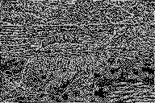

# MPI Image Reconstruction
## Introduction
MPI image processing demo by reconstructing original image from its edge image.

## Prerequisite
To get, build and install this project, following dependencies are required :

* MPI implementations

## Project Structure

* main.c : entry of this program
* defs.h : macro definition for working flow control
* arraytool : simple array tool for 2d continuous array allocation and deallocation
* boundary : sawtooth boundary value generator for top and buttom of the image with halo
* pgmio : simple pgm file IO library
* imgprocessing.h : abstracted image processing flow
* serial_imgprocessing.c : serial implementation for image processing in this program
* parallel_imgprocessing.c : parallel implementation with MPI for image processing in this program

## Build
To build this project, you can open your terminal and type:
    
    make

This will build the parallel version of this program. To build the serial version, type:

    make serial

Corresponding program with name parallel/serial will appear under current working directory.

## Usage
To run this program, type: 

    mpirun -n {n_processes} ./{program} {input} {output}

where:

* n_processes : number of processes running this program
* program : executables for this program, can be "parallel" or "serial" in this case
* input : path to the input file in pbm/pgm format
* output : path to the output file after reconstruction

## Demo
Assumed that user has already build the program.

Firstly, type the corresponding command:

    mpirun -n 4 ./parallel img/edgenew192x128.pbm img/parallel192x128.pbm

After execution, output file parallel192x128.pbm will appear under current working direcotry. We will get the results illustrated below.

### edgenew192x128.pbm

### parallel192x128.pbm

## Test
You can type following command to test:

    make test

This command will run tests on the given 4 images and check the results by comparing the output images from parallel command with the results obtained from serial version. Command __diff__ is used for pbm file comparasion. Test procedure can be found in the test script.